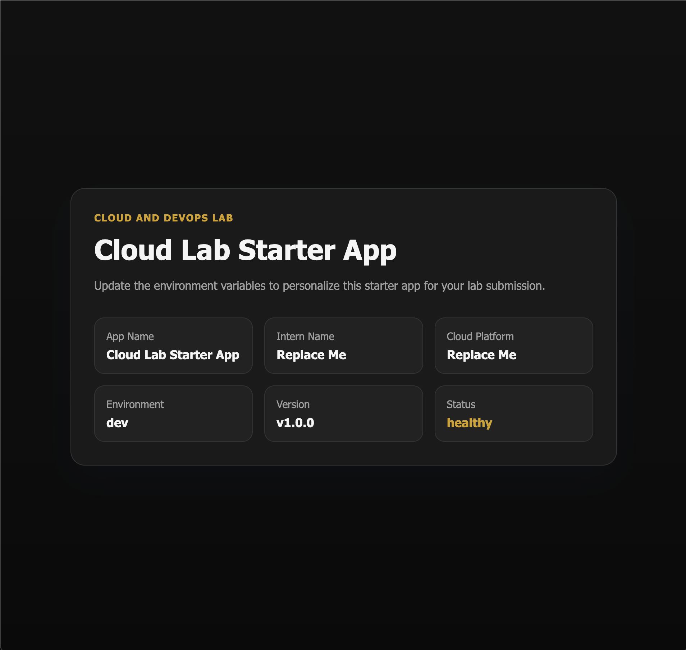
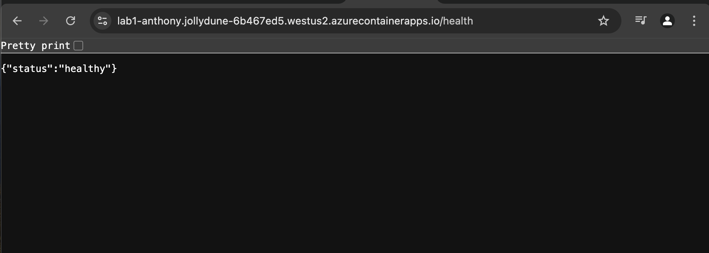

# Lab 1 — Cloud Lab Starter App

A containerized FastAPI application deployed to Azure Container Apps using Terraform and a CI/CD pipeline with GitHub Actions (OIDC authentication).

**Intern:** Anthony Uketui
**Cloud Platform:** Azure
**Live URL:** https://lab1-anthony.ashyocean-d74db9c0.westus2.azurecontainerapps.io

> **Note:** The live URL may be unavailable if infrastructure has been destroyed to avoid ongoing Azure charges. To redeploy, follow the Terraform and CI/CD instructions below.

---

## Architecture

```
GitHub (push to main)
    ↓
GitHub Actions (OIDC → Azure)
    ↓
┌─────────────┐     ┌──────────────────┐     ┌──────────────────────┐
│  Source      │ →   │  Build & Push     │ →   │  Deploy              │
│  Checkout    │     │  Docker → ACR     │     │  Azure Container App │
└─────────────┘     └──────────────────┘     └──────────────────────┘
```

**Infrastructure (managed by Terraform):**
- Azure Container Registry (ACR) — stores Docker images
- Azure Container App Environment — hosting platform
- Azure Container App — runs the application
- Azure Log Analytics Workspace — collects logs

---

## Routes

| Route | Description |
|-------|-------------|
| `/` | Homepage displaying app details (name, platform, environment, version, status) |
| `/health` | JSON health check endpoint returning `{"status": "healthy"}` with HTTP 200 |

### Homepage


### Health Check


---

## Environment Variables

All values are injected at runtime via Terraform (not baked into the Docker image).

| Variable | Description | Default |
|----------|-------------|---------|
| `APP_NAME` | Application display name | `Cloud Lab Starter App` |
| `INTERN_NAME` | Intern's full name | `Replace Me` |
| `CLOUD_PLATFORM` | Cloud provider (AWS/Azure) | `Replace Me` |
| `ENVIRONMENT` | Deployment environment | `dev` |
| `APP_VERSION` | Application version | `v1.0.0` |
| `APP_STATUS` | Application status | `healthy` |

For local development, create a `.env` file (gitignored):
```
APP_NAME=Cloud Lab Starter App
INTERN_NAME=Anthony Uketui
CLOUD_PLATFORM=Azure
ENVIRONMENT=dev
APP_VERSION=v1.4
APP_STATUS=healthy
```

---

## Project Structure

```
cognetiks-interns-lab1/
├── app/
│   ├── main.py                  # FastAPI application
│   ├── templates/
│   │   └── index.html           # Homepage template
│   └── static/
│       └── style.css            # Black and gold theme
├── infra/
│   ├── main.tf                  # Azure infrastructure (Container App, ACR, Log Analytics)
│   ├── variables.tf             # Terraform variable definitions
│   ├── outputs.tf               # Outputs (app URL)
│   └── terraform.tfvars.example # Example values (actual tfvars is gitignored)
├── .github/
│   └── workflows/
│       └── deploy.yml           # CI/CD pipeline (Source → Build → Deploy)
├── Dockerfile                   # Container image definition
├── requirements.txt             # Python dependencies
├── .dockerignore
├── .gitignore
└── README.md
```

---

## Run Locally (Without Docker)

1. Create and activate a virtual environment:
   ```bash
   python3 -m venv .venv
   source .venv/bin/activate
   ```

2. Install dependencies:
   ```bash
   pip install -r requirements.txt
   ```

3. Create a `.env` file with your values (see Environment Variables above).

4. Start the app:
   ```bash
   uvicorn app.main:app --reload
   ```

5. Open in browser:
   - Homepage: http://localhost:8000
   - Health check: http://localhost:8000/health

---

## Run With Docker

1. Build the image:
   ```bash
   docker build --platform linux/amd64 -t lab1-starter-app .
   ```

2. Run the container:
   ```bash
   docker run --rm -p 8000:8000 \
     -e INTERN_NAME="Anthony Uketui" \
     -e CLOUD_PLATFORM="Azure" \
     lab1-starter-app
   ```

3. Open in browser:
   - Homepage: http://localhost:8000
   - Health check: http://localhost:8000/health

---

## Infrastructure Deployment (Terraform)

The `infra/` directory contains Terraform configuration for Azure.

### Resources Created

| Resource | Purpose |
|----------|--------|
| **Resource Group** | Contains all Azure resources for the project. Created and managed by Terraform. |
| **Azure Container Registry (ACR)** | Stores Docker images. Created and managed by Terraform with admin access enabled. |
| **Log Analytics Workspace** | Collects and stores container logs. Required by Azure Container App Environment. Logs retained for 30 days. |
| **Container App Environment** | The hosting platform that provides shared networking, load balancing, and DNS for container apps. Similar to an ECS Cluster in AWS. |
| **Container App** | The running application. Pulls the image from ACR, runs it with 0.25 CPU and 0.5Gi memory, and exposes it to the internet via ingress on port 8000. Can scale from 0 to 10 replicas based on traffic. |

All resources are fully managed by Terraform — one `terraform apply` creates everything, one `terraform destroy` removes everything.

### How They Connect

```
Resource Group
        ↓ (contains)
Azure Container Registry (ACR)
        ↓ (stores images)
Log Analytics Workspace
        ↓ (sends logs to)
Container App Environment
        ↓ (hosts)
Container App → pulls image from ACR → serves traffic on port 8000
        ↓
Public URL (HTTPS)
```

### Key Design Decisions

| Decision | Why |
|----------|-----|
| Environment variables injected via Terraform | Config is not baked into the Docker image — same image can be reused across environments |
| Sensitive values in `terraform.tfvars` (gitignored) | Keeps personal config out of the repo. Example file provided for teammates |
| Minimal CPU/memory (0.25 CPU, 0.5Gi) | Keeps costs low for a lab while being sufficient for a small app |
| Single revision mode | Only one version runs at a time — simpler for a lab |
| ACR admin credentials stored as a Container App secret | Allows the Container App to pull images from the private registry securely |

### Usage

1. Create `infra/terraform.tfvars` from the example:
   ```bash
   cp infra/terraform.tfvars.example infra/terraform.tfvars
   ```

2. Edit `terraform.tfvars` with your values.

3. Deploy:
   ```bash
   cd infra
   terraform init
   terraform plan
   terraform apply
   ```

4. Get the app URL:
   ```bash
   terraform output app_url
   ```

5. Tear down when done:
   ```bash
   terraform destroy
   ```

---

## CI/CD Pipeline

The pipeline (`.github/workflows/deploy.yml`) runs automatically on every push to `main`.

### Stages

| Stage | What it does |
|-------|-------------|
| **Source** | Checks out the code and uploads it as an artifact |
| **Build** | Builds the Docker image for `linux/amd64` and pushes it to ACR |
| **Deploy** | Updates the Azure Container App with the new image |

### Authentication

The pipeline uses **OIDC (OpenID Connect)** — no passwords or secrets stored. GitHub and Azure exchange short-lived tokens at runtime through a federated trust.

Required GitHub Secrets (all are non-sensitive IDs, not passwords):

| Secret | Description |
|--------|-------------|
| `AZURE_CLIENT_ID` | Service principal app ID |
| `AZURE_TENANT_ID` | Azure AD tenant ID |
| `AZURE_SUBSCRIPTION_ID` | Azure subscription ID |

---

## Security Decisions

| Decision | Why |
|----------|-----|
| Non-root container user | Limits damage if the app is compromised |
| No shell access (`/bin/false`) | Prevents interactive access inside the container |
| OIDC authentication | No passwords stored in GitHub — short-lived tokens only |
| `.env` gitignored | Prevents local config from being pushed to the repo |
| `terraform.tfvars` gitignored | Keeps deployment values local, example file provided |
| Environment variables injected at runtime | Config is not baked into the Docker image |
| Proxy headers enabled | Ensures correct HTTPS URL generation behind Azure's load balancer |

---

## Tech Stack

| Tool | Purpose |
|------|---------|
| Python / FastAPI | Web application framework |
| Uvicorn | ASGI server |
| Jinja2 | HTML templating |
| Docker | Containerization |
| Azure Container Registry | Image storage |
| Azure Container Apps | Container hosting |
| Terraform | Infrastructure as Code |
| GitHub Actions | CI/CD pipeline |

---

## Cleanup

To avoid ongoing charges, destroy all resources:

```bash
# Terraform removes everything (Resource Group, ACR, Container App, Environment, Log Analytics)
cd infra && terraform destroy
```

---

## Problems Encountered & Solutions

| Problem | Cause | Solution |
|---------|-------|----------|
| `docker push` failed with `insufficient_scope` | ACR was created with ABAC Repository Permissions mode, which requires extra repository-level permissions | Recreated ACR with standard RBAC mode (`LegacyRegistryPermissions`) |
| Container App failed with `no child with platform linux/amd64` | Docker built the image for `linux/arm64` (Apple Silicon Mac) but Azure needs `linux/amd64` | Added `--platform linux/amd64` to the `docker build` command |
| CSS not loading on deployed app (unstyled page) | FastAPI generated `http://` URLs for static files, but the app is served over `https://`. Browser blocked mixed content | Added `--proxy-headers` and `--forwarded-allow-ips *` to the Uvicorn command so it trusts the load balancer's forwarded headers |
| `MissingSubscriptionRegistration` for `Microsoft.App` | Azure subscription hadn't registered the Container Apps resource provider | Ran `az provider register --namespace Microsoft.App` |
| CSS changes not appearing after rebuild and deploy | Docker used cached layers from a previous build that still had the old CSS | Used `--no-cache` flag on `docker build` to force a clean rebuild |
| `terraform apply` failed with "resource already exists" | A previous failed `terraform apply` created a broken resource in Azure that Terraform didn't track in its state | Deleted the broken resource with `az containerapp delete` then re-ran `terraform apply` |
| `git push` rejected workflow file | GitHub OAuth token didn't have the `workflow` scope needed to push `.github/workflows/` files | Switched from HTTPS to SSH authentication for git |
| ACR login expired during push | ACR access tokens are short-lived | Re-ran `az acr login --name cogneticsregistry` before pushing |
